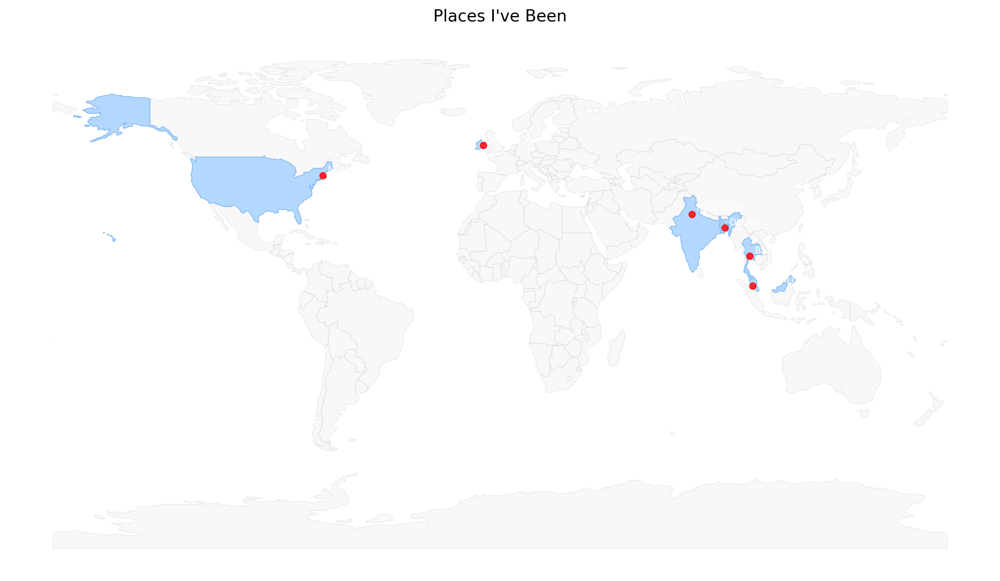

## 👋 Hey there, I’m Rezwan Kabir — Code Alchemist, AI Whisperer & Automation Addict ⚙️🤖  

Welcome to my digital lab! I blend **code, AI, and caffeine** to build scalable, intelligent systems that (sometimes) do the thinking for you. My playground? A mashup of **React**, **NestJS**, **Azure AI**, and the occasional **Raspberry Pi experiment** gone *beautifully right*.  

---

### 🚀 What I’m Currently Crafting

- Architecting **next-gen web apps** powered by **ReactJS**, **NestJS**, and **serverless** magic  
- Building **AI-enhanced search ecosystems** using **Azure Cognitive Search** + **RAG (Retrieval-Augmented Generation)**  
- Automating *everything*—from my **smart home** to **data pipelines** and **developer workflows**  
- Experimenting with **IoT devices**, **voice-controlled automation**, and **edge AI** on **Raspberry Pi**  
- Exploring **Blockchain**, **Smart Contracts**, and **Web3 ecosystems**  

---

### 🧠 My Curiosity Loop (What I’m Learning)
- **Advanced Machine Learning** & **Neural Network Optimization**  
- **Hybrid Search** combining embeddings, semantics & metadata ranking  
- **Efficient Data Retrieval Pipelines** with vector search & graph-based indexing  
- Deep diving into **.NET**, **NodeJS**, **Python**, **Blockchain**, **Solidity**, **Golang**, and **Web3**  

---

### 🤝 Let’s Collaborate If You’re Into:  
- **AI-driven apps**, **automation frameworks**, and **open-source** innovation  
- **Healthcare tech** that bridges humans and algorithms  
- **Smart home ecosystems**, **IoT integrations**, or **R&D experiments** that push boundaries  
- **Blockchain + Web3 solutions** that merge decentralization with intelligence  

---

### 🧩 Ask Me About
- **Full-stack wizardry** with React, NestJS & TypeScript  
- **RAG systems**, **Cognitive Search**, and **LLM fine-tuning**  
- **Smart Contracts** and **Ethereum development** with Solidity  
- Setting up **Home Assistant + Raspberry Pi** automations that make Alexa jealous  
- The art of making **AI work in real-world products**, not just demos  

---

### 📡 Find Me On The Grid
- 🌐 [rezwan.ie](https://rezwan.ie)  
- 🧬 [LinkedIn: Rezwan Kabir](https://www.linkedin.com/in/rez1kabir/)  
- 📧 [rezwan.rez1@gmail.com](mailto:rezwan.rez1@gmail.com)  
- 🧑‍💻 [GitHub: rez1kabir](https://github.com/rez1kabir)  

---

### 🗺 Where I’ve Been

> Countries so far: USA 🇺🇸 · Malaysia 🇲🇾 · Ireland 🇮🇪 · Bangladesh 🇧🇩 · India 🇮🇳 · Thailand 🇹🇭  
> Cities/areas: Massachusetts · Kuala Lumpur · Newbridge · Dhaka · Kolkata · Bangkok

---

### ⚡ Fun Fact
I built my own **AI-powered smart home control hub**  that uses facial recognition to ID visitors before they ring the bell, adapts lighting by zone, time, and motion, syncs with prayer schedules, and fully automates night routines. Basically — Jarvis lives inside my Raspberry Pi. 🧠💡🏠  

---

### 🧰 Languages, Tools & Arcane Dev Magic  

 
 
 
 
 
 
 
 
 
 
 
 
 
 

---

### 🛠 Tech Arsenal
- **Frontend**: ReactJS, Angular, TypeScript, Chakra UI  
- **Backend**: NestJS, Node.js, Express, .NET  
- **Databases**: PostgreSQL, Azure Cognitive Search, MongoDB, MySQL  
- **Automation & IoT**: Home Assistant, Raspberry Pi, MQTT, Node-RED  
- **AI & ML**: Python, TensorFlow, OpenAI, LangChain, Azure OpenAI  
- **Blockchain & Web3**: Solidity, Ethereum, Golang, Hardhat, IPFS  

---

### 🧪 Motto
> *“If it can be automated, optimized, decentralized, or made smarter — I’ll find a way to do it.”*
